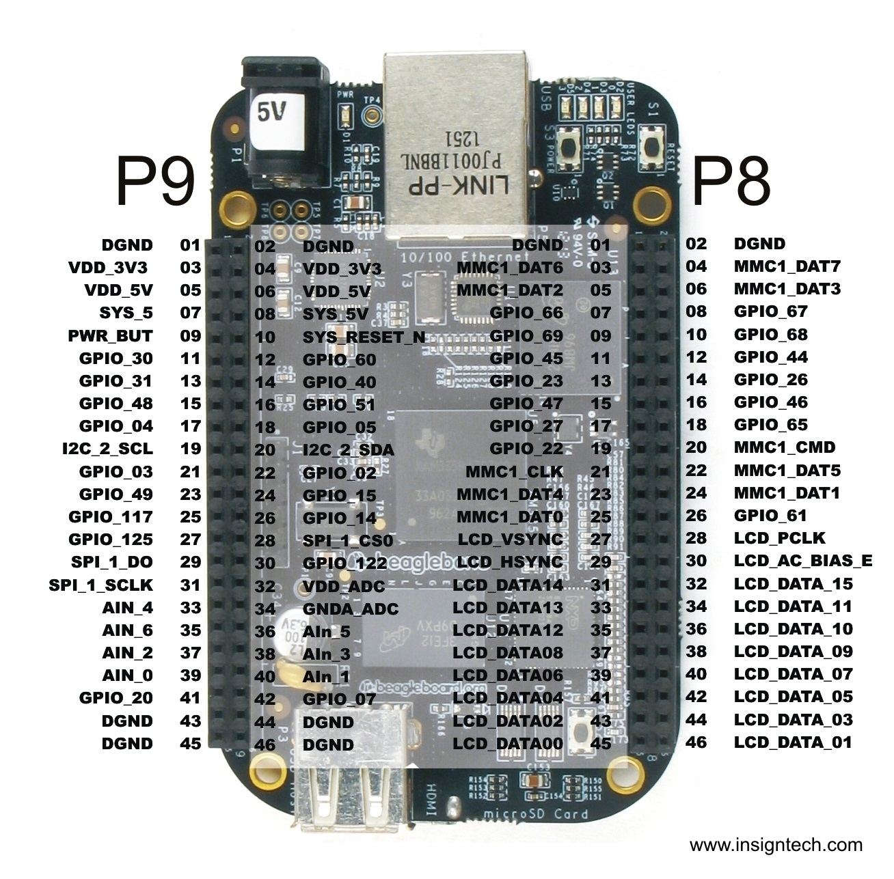

# IoT-Hobby-Projects with the Beaglebone

## Getting Started

Head to [this page](http://beagleboard.org/static/beaglebone/latest/README.htm) to get the drivers installed on your machine.  This will take 5-10 minutes.

>**Note:** You only need to complete Step 1 (plug in to USB) and Step 2 (install drivers) on this page.

Once the drivers are installed, you should be able to SSH into your Beaglebone.

### Details:

- IP Address: *instructor will tell you*
- Username: root
- Password: *instructor will tell you*

Take a look around, looks pretty familiar to your Mac Terminal, right?  Files in different places, but you will notice some similarly named files, and most of the commands you use on your Mac will work here.

>**Note:** With great power comes great responsibility.  Be careful with this machine, the same way you would be with your computer.  Don't delete or move things you don't understand.  It is very possible to put it in a state that is unrecoverable by deleting the wrong file.

## Turning the Light on

For the remainder of these steps, you will find the diagram below very useful.  It diagrams all of the input/output, power, and ground ports on the Beaglebone.

Head to [this page](http://www.circuidipity.com/bbb-led.html) for a quick tutorial to get you set up with your "IoT Hello World" by blinking lights!  Take turns driving so everyone can get a feel for the computer and what it can do.

## Taking the Temperature

Head to [this page](http://www.bonebrews.com/temperature-monitoring-with-the-ds18b20-on-a-beaglebone-black/) for a tutorial to take the temperature with a digital thermometer.

## Making a Web Server

Just like with any other computer, you can start a web server by creating an `index.html` file and running `python -m SimpleHTTPServer`.  Make sure python is installed first.

Once you have a server running, use Chrome on your Mac (the one connected to the Beaglebone) to check out your hello world page.  What IP address and port should you use?

## Is the Button Pressed?

Now that you can turn a light on (output), let's try playing with the other side (input).  Head to [this page](https://learn.adafruit.com/connecting-a-push-button-to-beaglebone-black/overview) for a tutorial on this.

## Turning a Power Strip on

Using `crontab`, and a [solid state relay](https://en.wikipedia.org/wiki/Solid-state_relay), you can time a whole power strip of devices to turn off or on at certain times.  This can help cut down on your energy bills.

A certain instructor used this functionality to create a small garden of lettuce and radishes in their basement apartment bedroom (turning lights on at 7 every morning, and off at 10 ever night).

## Being an Awesome Boyfriend/Girlfriend

For someone's birthday, you could create a mail server that sends a cute quote to their email everytime they press a button.  It can also send an email to you to let you know they miss you.

## Using Johnny5

Head to [this page](http://johnny-five.io/) to redo your hello-world, but this time **with javascript**.  Scroll down to `Hello World!` and click the `Beaglebone` link to see how to write the code (on the left) and how to set up the hardware (on the right).

## Other Ideas

What would you like to do with Internet of Things?  After the break, pitch your idea, and we'll assemble teams.
